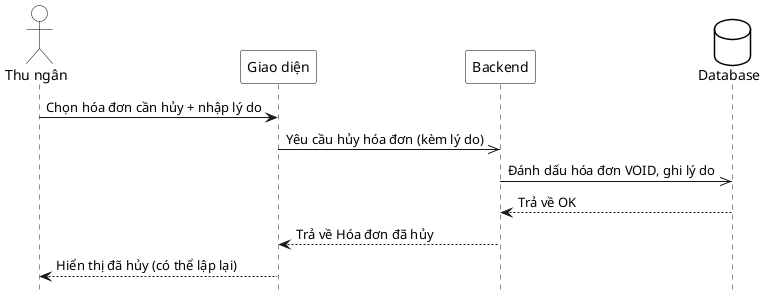

# Đặc tả Use-Case — Nhóm THU NGÂN (CASHIER)

> **Group:** THU NGÂN (CASHIER)
> **Nguồn:** Bổ sung từ hệ thống đã triển khai (không có trong danh sách UC-01…31 gốc).
> Route: `POST /api/v1/restaurant/invoices/:id/void` (quyền `billing:process`).

---

## UC-C36 — Hủy hóa đơn (void)

### 1) Use-case đặc tả tổng quan

*Hình: ĐẶC TẢ USE-CASE THU NGÂN — HỦY HÓA ĐƠN*
Tác nhân **Thu ngân** giao tiếp với use-case «Hủy hóa đơn»; use-case «include» «Ghi lý do hủy» (audit). Dùng khi hóa đơn lập sai và cần bỏ để lập lại. Hóa đơn `VOID` không còn chặn đóng phiên (UC-C25 chỉ chặn hóa đơn khác `VOID`/`PAID`).

### 2) Bảng use-case chi tiết

| Mục | Nội dung |
|---|---|
| **Tên Use-Case** | Hủy hóa đơn (void) |
| **Tác nhân** | Thu ngân (Cashier) — phụ: Hệ thống |
| **Mô tả** | Thu ngân hủy một hóa đơn kèm lý do. Hệ thống đánh dấu hóa đơn `VOID`, ghi lý do (audit) và phát realtime. Sau đó có thể lập lại hóa đơn cho phiên (UC-C21). |
| **Điều kiện** | Thu ngân đã đăng nhập (JWT, quyền `billing:process`). Hóa đơn tồn tại. |

**Luồng sự kiện chính (Thành công)**

| STT | Thực hiện bởi | Mô tả hành động | Kết quả hệ thống |
|---|---|---|---|
| 1 | Thu ngân | Chọn hóa đơn cần hủy, nhập lý do. | Giao diện gọi `POST /restaurant/invoices/:id/void` (`{ void_reason }`). |
| 2 | Hệ thống | Đánh dấu hóa đơn `VOID`, ghi lý do. | Cập nhật trạng thái `VOID`; phát `billing.invoice_voided`. |
| 3 | Thu ngân | Nhận kết quả. | Hiển thị hóa đơn đã hủy; có thể lập lại. |

**Luồng sự kiện thay thế**

| STT | Thực hiện bởi | Mô tả hành động | Kết quả hệ thống |
|---|---|---|---|
| 1a | Hệ thống | Thiếu `invoice_id` / hóa đơn không tồn tại. | Trả lỗi `400/404`; không hủy. |

**Hậu điều kiện**

| | |
|---|---|
| **Thành công** | Hóa đơn `VOID`, lý do được ghi audit; sự kiện `billing.invoice_voided` phát realtime; phiên có thể lập lại hóa đơn. |
| **Thất bại** | Hóa đơn không tồn tại → báo lỗi; trạng thái giữ nguyên. |

### 3) Sơ đồ tuần tự (Sequence)

