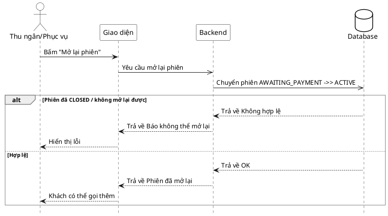

# Đặc tả Use-Case — Nhóm THU NGÂN (CASHIER)

> **Group:** THU NGÂN (CASHIER) — dùng chung với Phục vụ
> **Nguồn:** Bổ sung từ hệ thống đã triển khai (không có trong danh sách UC-01…31 gốc).
> Route: `POST /api/v1/restaurant/sessions/:sessionId/reopen` (route nhóm staff ordering).

---

## UC-C37 — Mở lại phiên

### 1) Use-case đặc tả tổng quan

*Hình: ĐẶC TẢ USE-CASE THU NGÂN — MỞ LẠI PHIÊN*
Tác nhân **Thu ngân/Phục vụ** giao tiếp với use-case «Mở lại phiên»; đảo trạng thái khóa order do «Yêu cầu thanh toán» (UC-G08) đặt. Khi khách muốn gọi thêm sau khi đã bấm thanh toán, nhân viên mở lại phiên `AWAITING_PAYMENT → ACTIVE` để tiếp tục đặt món.

### 2) Bảng use-case chi tiết

| Mục | Nội dung |
|---|---|
| **Tên Use-Case** | Mở lại phiên |
| **Tác nhân** | Thu ngân / Phục vụ — phụ: Hệ thống |
| **Mô tả** | Nhân viên mở lại một phiên đang `AWAITING_PAYMENT`, chuyển về `ACTIVE` để bỏ khóa đặt/sửa món. Hệ thống cập nhật trạng thái và phát realtime để khách/màn bếp cập nhật. |
| **Điều kiện** | Nhân viên đã đăng nhập (JWT, quyền staff). Phiên đang `AWAITING_PAYMENT` và chưa `CLOSED`. |

**Luồng sự kiện chính (Thành công)**

| STT | Thực hiện bởi | Mô tả hành động | Kết quả hệ thống |
|---|---|---|---|
| 1 | Nhân viên | Bấm "Mở lại phiên". | Giao diện gọi `POST /restaurant/sessions/:sessionId/reopen`. |
| 2 | Hệ thống | Chuyển phiên `AWAITING_PAYMENT → ACTIVE`. | Cập nhật trạng thái; phát `dining.session_reopened`. |
| 3 | Nhân viên | Nhận kết quả. | Phiên mở lại; khách có thể gọi thêm món. |

**Luồng sự kiện thay thế**

| STT | Thực hiện bởi | Mô tả hành động | Kết quả hệ thống |
|---|---|---|---|
| 2a | Hệ thống | Phiên đã `CLOSED` / không ở trạng thái mở lại được. | Từ chối; báo không thể mở lại. |

**Hậu điều kiện**

| | |
|---|---|
| **Thành công** | Phiên `ACTIVE` trở lại (bỏ khóa order); sự kiện `dining.session_reopened` phát realtime; khách gọi thêm được. |
| **Thất bại** | Phiên đã đóng / không hợp lệ → không đổi trạng thái. |

### 3) Sơ đồ tuần tự (Sequence)

